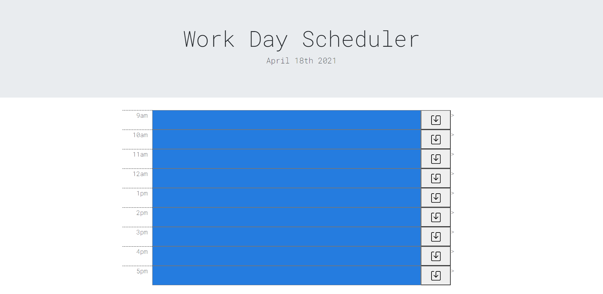

# Work-Day-Scheduler

User can input events for each hour of a work day and keep track of their tasks. The site also color codes the hour depending on the time. 

https://raguayo101.github.io/Work-Day-Scheduler/+

